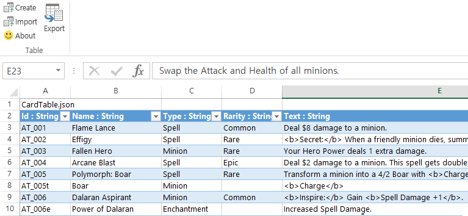

# ExcelJsonTable

ExcelJsonTable is an excel add-in to import table from json and export table to
json. It is written for users to input table-like data by Excel easily and export
data to json format for being read by program correctly.

### Where can I get it?

Visit [Release](https://github.com/SaladbowlCreative/ExcelJsonTable/releases) page to get latest add-in install file.

### Example

Those are card data of famous game [Hearthstone](http://us.battle.net/hearthstone).
(Data was collected from https://hearthstonejson.com)



You can easily update data within excel. After exporting data, following json file
is saved. [TemplateTable](https://github.com/SaladbowlCreative/TemplateTable) might be
usuful to read and write json table.

```json
[
  {
    "Id": "AT_001",
    "Name": "Flame Lance",
    "Type": "Spell",
    "Rarity": "Common",
    "Text": "Deal $8 damage to a minion.",
    "...": "..."
  },
  {
    "Id": "AT_002",
    "Name": "Effigy",
    "Type": "Spell",
    "Rarity": "Rare",
    "...": "..."
  },
  "..."
]
```

### Create

With json-file, you can build table as json looks like.
- Click `Create` button and choose file, table data will be created from json.

### Import

Basically it is almost same with `Create`. But import keeps original excel
layout if possible.
- Click `Import` button and choose file, table data will be imported from json.

### Export

- Click `Export` button and choose file, table data will be exported to json.
